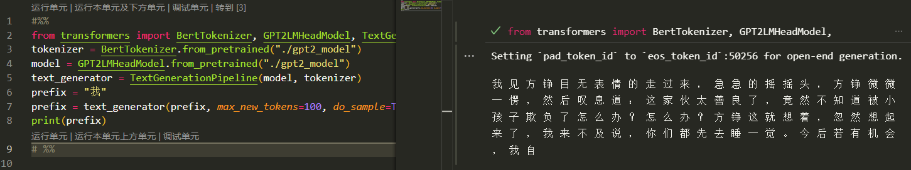

# GPT2 Fine-tuning 简短Trainer

预训练模型推荐这里的通用中文预训练模型：https://github.com/Morizeyao/GPT2-Chinese

## 依赖
+ torch==1.10.0+cu113
+ transformers==4.12.5
+ datasets==2.0.0

## 文件结构
+ 新建pretrained文件夹，将预训练模型放在里面
+ train数据集直接以一行一个txt文本的形式放在train.txt中即可
+ eval同理

## 使用方式
先将数据和预训练模型配置好之后，执行
```
python3 preprocess.py
```
进行数据预处理

然后执行
```
python3 train_gpt.py
```
进行训练即可

**注意，如果不需要训练完后关机记得把train_gpt.py最后一行注释掉**

训练完成可以执行text_generator.py试试看

在用本项目中的参数结合一些小说数据做fine-tuning之后的效果：

